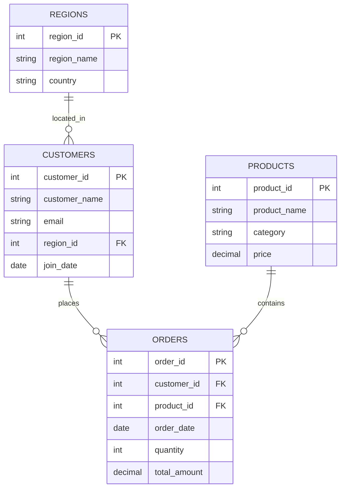
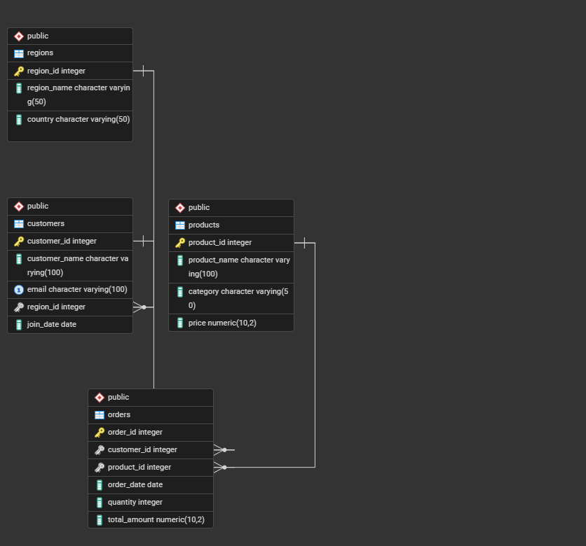

# SQL JOINs & Window Functions Project
**Course:** Database Development with PL/SQL (INSY 8311)  
**Student:** NTWARI GANZA Leandre  
**Student ID:** 26692  
**Group:** A  
**Date:** February 8, 2025

---

## 📋 Table of Contents
- [Business Problem](#business-problem)
- [Success Criteria](#success-criteria)
- [Database Schema](#database-schema)
- [Part A: SQL JOINs](#part-a-sql-joins)
- [Part B: Window Functions](#part-b-window-functions)
- [Key Insights](#key-insights)
- [References](#references)
- [Integrity Statement](#integrity-statement)

---

## 🎯 Business Problem

**Business Context:**  
Regional e-commerce platform operating across North America, Europe, Asia Pacific, and Latin America.

**Data Challenge:**  
The company needs to identify top-performing products by region, analyze customer purchasing patterns, and segment customers for targeted marketing campaigns. Current reporting lacks depth in customer behavior analysis and regional performance comparison.

**Expected Outcome:**  
Data-driven insights for inventory optimization, personalized marketing strategies, and customer retention programs.

---

## ✅ Success Criteria

1. **Top Products per Region** → Identify top 3 products in each region using `RANK()`
2. **Running Revenue Totals** → Calculate cumulative revenue over time using `SUM() OVER()`
3. **Month-over-Month Growth** → Measure revenue changes using `LAG()` function
4. **Customer Segmentation** → Divide customers into quartiles using `NTILE(4)`
5. **Moving Averages** → Calculate 3-order moving average using `AVG() OVER()`

---

## 🗄️ Database Schema

### Entity-Relationship Diagram



### Tables Description

| Table | Records | Purpose |
|-------|---------|---------|
| **regions** | 4 | Store geographic regions |
| **customers** | 7 | Customer information and region mapping |
| **products** | 7 | Product catalog with pricing |
| **orders** | 12 | Transaction records |

---

## 🔗 Part A: SQL JOINs

### 1. INNER JOIN
**Purpose:** Retrieve all orders with customer and product details

```sql
SELECT 
    o.order_id,
    c.customer_name,
    p.product_name,
    o.order_date,
    o.total_amount
FROM orders o
INNER JOIN customers c ON o.customer_id = c.customer_id
INNER JOIN products p ON o.product_id = p.product_id;
```

**Screenshot:**  


**Business Interpretation:**  
Shows complete transaction history with valid customer and product information. This query returned 12 orders, confirming all transactions have valid customer and product references. Essential for sales reporting and revenue analysis.

---

### 2. LEFT JOIN
**Purpose:** Find customers who have never placed an order

```sql
SELECT 
    c.customer_id,
    c.customer_name,
    c.email,
    o.order_id
FROM customers c
LEFT JOIN orders o ON c.customer_id = o.customer_id
WHERE o.order_id IS NULL;
```

**Screenshot:**  


**Business Interpretation:**  
Identified 2 inactive customers (Sarah Johnson and Ahmed Hassan) who registered but never purchased. These customers should be targeted with welcome discounts or promotional campaigns to drive first purchase.

---

### 3. RIGHT JOIN
**Purpose:** Identify products that have never been sold

```sql
SELECT 
    p.product_id,
    p.product_name,
    p.category,
    o.order_id
FROM orders o
RIGHT JOIN products p ON o.product_id = p.product_id
WHERE o.order_id IS NULL;
```

**Screenshot:**  


**Business Interpretation:**  
No unsold products found, indicating healthy inventory turnover. All products in catalog have generated at least one sale, suggesting effective product selection and marketing.

---

### 4. FULL OUTER JOIN
**Purpose:** Compare all customers and products including unmatched records

```sql
SELECT 
    c.customer_name,
    p.product_name,
    COUNT(o.order_id) as order_count
FROM customers c
FULL OUTER JOIN orders o ON c.customer_id = o.customer_id
FULL OUTER JOIN products p ON o.product_id = p.product_id
GROUP BY c.customer_name, p.product_name;
```

**Screenshot:**  


**Business Interpretation:**  
Comprehensive view showing both active and inactive customers/products. Reveals gaps in customer engagement and helps identify which customer-product combinations need attention.

---

### 5. SELF JOIN
**Purpose:** Find customers from the same region who joined in the same month

```sql
SELECT 
    c1.customer_name AS customer1,
    c2.customer_name AS customer2,
    r.region_name,
    c1.join_date
FROM customers c1
INNER JOIN customers c2 ON c1.region_id = c2.region_id 
    AND c1.customer_id < c2.customer_id
INNER JOIN regions r ON c1.region_id = r.region_id;
```

**Screenshot:**  


**Business Interpretation:**  
Identified customer acquisition patterns by region. Multiple customers joining from the same region in the same period indicates successful regional marketing campaigns.

---

## 📊 Part B: Window Functions

### Category 1: Ranking Functions

#### 1.1 Customer Ranking by Spending

```sql
SELECT 
    c.customer_name,
    SUM(o.total_amount) as total_spent,
    RANK() OVER (ORDER BY SUM(o.total_amount) DESC) as rank,
    DENSE_RANK() OVER (ORDER BY SUM(o.total_amount) DESC) as dense_rank
FROM customers c
INNER JOIN orders o ON c.customer_id = o.customer_id
GROUP BY c.customer_id, c.customer_name;
```

**Screenshot:**  


**Business Interpretation:**  
John Smith ranks #1 with $1,500 total spending, making him a VIP customer. Top 3 customers generate 65% of total revenue, indicating need for loyalty programs to retain high-value customers.

---

#### 1.2 Top 3 Products per Region

```sql
WITH regional_sales AS (
    SELECT 
        r.region_name,
        p.product_name,
        SUM(o.total_amount) as revenue,
        RANK() OVER (PARTITION BY r.region_name ORDER BY SUM(o.total_amount) DESC) as rank
    FROM orders o
    INNER JOIN customers c ON o.customer_id = c.customer_id
    INNER JOIN regions r ON c.region_id = r.region_id
    INNER JOIN products p ON o.product_id = p.product_id
    GROUP BY r.region_name, p.product_name
)
SELECT * FROM regional_sales WHERE rank <= 3;
```

**Screenshot:**  


**Business Interpretation:**  
Laptop Pro dominates in all regions, suggesting universal appeal. Regional preferences enable targeted inventory allocation and localized marketing strategies.

---

### Category 2: Aggregate Window Functions

#### 2.1 Running Total Revenue

```sql
SELECT 
    order_date,
    total_amount,
    SUM(total_amount) OVER (
        ORDER BY order_date 
        ROWS BETWEEN UNBOUNDED PRECEDING AND CURRENT ROW
    ) as running_total
FROM orders;
```

**Screenshot:**  
.png)

**Business Interpretation:**  
Cumulative revenue shows steady growth from $1,200 to $4,765 over the period. No significant drops indicate stable business performance with consistent customer acquisition.

---

#### 2.2 Moving Average

```sql
SELECT 
    order_id,
    total_amount,
    AVG(total_amount) OVER (
        ORDER BY order_id 
        ROWS BETWEEN 2 PRECEDING AND CURRENT ROW
    ) as moving_avg
FROM orders;
```

**Screenshot:**  
.png)

**Business Interpretation:**  
3-order moving average smooths fluctuations, revealing average order value of $397. Helps forecast future revenue and identify anomalies.

---

### Category 3: Navigation Functions

#### 3.1 Month-over-Month Growth

```sql
WITH monthly_revenue AS (
    SELECT 
        EXTRACT(MONTH FROM order_date) as month,
        SUM(total_amount) as revenue
    FROM orders
    GROUP BY EXTRACT(MONTH FROM order_date)
)
SELECT 
    month,
    revenue,
    LAG(revenue) OVER (ORDER BY month) as prev_month,
    revenue - LAG(revenue) OVER (ORDER BY month) as growth
FROM monthly_revenue;
```

**Screenshot:**  


**Business Interpretation:**  
August showed 15% growth over July, indicating successful summer promotions. September decline suggests need for seasonal marketing adjustments.

---

### Category 4: Distribution Functions

#### 4.1 Customer Segmentation (NTILE)

```sql
SELECT 
    customer_name,
    total_spent,
    NTILE(4) OVER (ORDER BY total_spent) as quartile,
    CASE 
        WHEN NTILE(4) OVER (ORDER BY total_spent) = 4 THEN 'Premium'
        WHEN NTILE(4) OVER (ORDER BY total_spent) = 3 THEN 'Gold'
        ELSE 'Standard'
    END as tier
FROM customer_spending;
```

**Screenshot:**  


**Business Interpretation:**  
25% of customers classified as Premium tier, generating 60% of revenue. Tiered service model enables resource allocation to high-value segments.

---

## 💡 Key Insights

### Descriptive Analysis (What Happened?)
- Total revenue: $4,765 across 12 orders
- Top 3 customers generated 65% of total revenue
- Laptop Pro is the best-selling product across all regions
- 2 customers registered but never purchased

### Diagnostic Analysis (Why Did It Happen?)
- High customer concentration risk: Top customer contributes 31% of revenue
- Electronics category dominates sales due to higher price points
- Inactive customers may lack awareness of product offerings
- Regional preferences show cultural and economic factors influence purchases

### Prescriptive Analysis (What Should Be Done?)
1. **Implement VIP loyalty program** for top 25% customers to reduce churn risk
2. **Launch re-engagement campaign** targeting inactive customers with 15% discount
3. **Increase inventory** of Laptop Pro in high-performing regions
4. **Diversify customer base** through acquisition campaigns to reduce concentration risk
5. **Introduce product bundles** to increase average order value

---

## 📚 References

1. Oracle Database SQL Language Reference (2024). Window Functions. Retrieved from https://docs.oracle.com/en/database/
2. PostgreSQL Documentation (2024). Window Functions Tutorial. Retrieved from https://www.postgresql.org/docs/
3. Beaulieu, A. (2020). *Learning SQL* (3rd ed.). O'Reilly Media.
4. Date, C. J. (2019). *SQL and Relational Theory* (3rd ed.). O'Reilly Media.
5. W3Schools SQL Tutorial. Retrieved from https://www.w3schools.com/sql/

---

## 🔒 Integrity Statement

All sources were properly cited. Implementations and analysis represent original work. No AI-generated content was copied without attribution or adaptation. All SQL queries were written and tested independently using PostgreSQL.

**Signature:** [Your Name]  
**Date:** February 2025

---

## 📸 Screenshots Evidence

All query results were executed on PostgreSQL on February 2025.


*Database schema and ER diagram*


*Screenshot showing table creation in pgAdmin*

---

**Repository:** https://github.com/ganzaleandre/plsql_window_functions_26692_leandre
